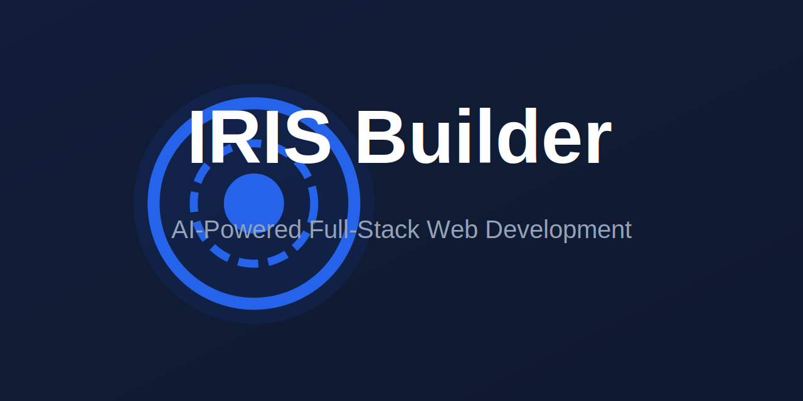

# IRIS Builder

[](https://youclick.io)

Welcome to IRIS Builder, an AI-powered development environment that allows you to choose the LLM that you use for each prompt! Currently, you can use OpenAI, Anthropic, Ollama, OpenRouter, Gemini, LMStudio, Mistral, xAI, HuggingFace, DeepSeek, or Groq models - and it is easily extended to use any other model supported by the Vercel AI SDK!

## Features

- **AI-powered full-stack web development** directly in your browser
- **Support for multiple LLMs** with an extensible architecture
- **Attach images to prompts** for better contextual understanding
- **Integrated terminal** to view output of LLM-run commands
- **Revert code to earlier versions** for easier debugging
- **Download projects as ZIP** for easy portability
- **Integration-ready Docker support** for hassle-free setup

## Quick Start

### Option 1: Direct Installation

1. **Install Package Manager (pnpm)**:
   ```bash
   npm install -g pnpm
   ```

2. **Install Project Dependencies**:
   ```bash
   pnpm install
   ```

3. **Start the Application**:
   ```bash
   pnpm run dev
   ```

### Option 2: Using Docker

1. **Build the Docker Image**:
   ```bash
   docker build . --target bolt-ai-development
   ```

2. **Run the Container**:
   ```bash
   docker-compose --profile development up
   ```

## Configuring API Keys

1. Create a `.env` file from `.env.example`
2. Add your API keys for the AI models you want to use
3. Restart the application

### Supported AI Providers
- OpenAI
- Anthropic
- Ollama
- OpenRouter
- Gemini
- LMStudio
- Mistral
- xAI
- HuggingFace
- DeepSeek
- Groq
- Perplexity

## Available Scripts

- `pnpm run dev`: Start development server
- `pnpm run build`: Build for production
- `pnpm run preview`: Preview production build
- `pnpm test`: Run tests
- `pnpm run lint:fix`: Fix linting issues

## Contributing

We welcome contributions! Please feel free to submit a Pull Request.

## License

MIT License - see LICENSE file for details
